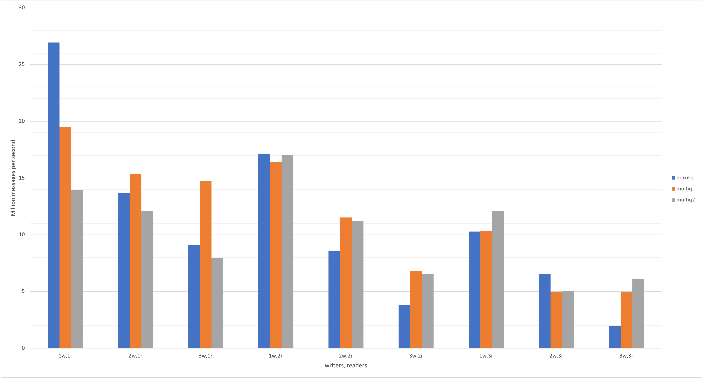

# Nexusq
**A fast multi producer multi consumer broadcast channel 
based on [LMAX Disruptor](https://github.com/LMAX-Exchange/disruptor)**

## What is it?
* Multi producer, multi consumer broadcasting channel (all consumers see all messages)
* Built on top of a fixed size ring buffer and uses *almost* no locks
  * Locks are only used when creating/removing a consumer, often these operations will not 
  block other producers or consumers and when it does it's minuscule.
* Supports batch reads and writes which also come with a nice performance boost, especially for copy types.
* Provides both a blocking and async API which can be used interchangeably on the same channel.

Nexusq makes heavy use of **unsafe** but provides a (probably) safe API. 
Development of Nexusq has been a personal learning project and there are no guarantees that
it is correct.

# Benchmarks
|         | 1w,1r  | 1w,2r  | 1w,3r  | 2w,1r  | 2w,2r  | 2w,3r  | 3w,1r  | 3w,2r  | 3w,3r  |
|---------|--------|--------|--------|--------|--------|--------|--------|--------|--------|
| nexusq  | 24.456 | 15.825 | 10.036 | 13.745 | 9.0724 | 6.5236 | 8.967  | 4.1999 | 2.0336 |
| multi   | 16.404 | 9.2243 | 5.2459 | 13.937 | 5.624  | 4.6864 | 8.8758 | 6.2498 | 4.8834 |
| multiq2 | 17.046 | 10.787 | 6.7643 | 11.818 | 6.2914 | 4.9649 | 7.3721 | 6.3057 | 5.8492 |

